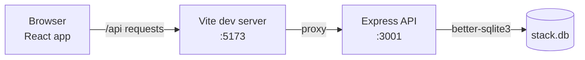
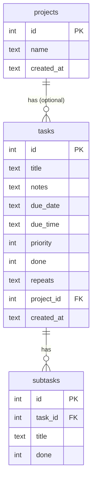

# Stack

**Author:** Mehedi Haque
**Course:** Software Development Skills: Full-Stack 2025-26, LUT University

Stack is a task manager you run in the browser. React on the front, an Express
API on the back, and a SQLite file for storage. There is a short video of it
running, see `VIDEO.md`.

## What it does

- Tasks with details, a due date, a time of day and a priority
- Anything past its date or time is marked overdue
- Three views: today, the coming week, and a month calendar you can add tasks to
- Projects to group tasks, listed in the sidebar
- A checklist of steps inside a task
- Tasks that repeat daily, weekly or monthly. Finishing one creates the next
- Search, open/done filtering, dark mode, and a layout that survives a phone

## Built with

- Frontend: React (Vite)
- Backend: Node.js + Express
- Database: SQLite (better-sqlite3)

## How it fits together

The React app never talks to the database. It calls `/api/...`, the Vite dev
server forwards that to the Express server on port 3001, and Express is the
only thing that touches the SQLite file.



## How to run

You need Node.js. Open two terminals.

Backend:

```
cd server
npm install
npm start        # API on http://localhost:3001
```

Frontend:

```
cd client
npm install
npm run dev      # app on http://localhost:5173
```

The client proxies `/api` to port 3001, so start the server first. The
database file (`server/stack.db`) is created automatically on first start.

## Database

Three tables. A project has tasks, a task has checklist steps. Deleting a task
removes its steps with it (cascade), but deleting a project keeps the tasks
and just leaves them without a project.



`priority` is 1 (urgent) to 4 (low). `repeats` is `daily`, `weekly`,
`monthly` or empty for a one-off task. The `due_time`, `repeats` and
`project_id` columns were added along the way, so `db.js` checks for them and
adds them to older database files if they are missing.

## API

| Method | Path | What it does |
| --- | --- | --- |
| GET | `/api/tasks` | list tasks (`?search=`, `?status=open\|done`, `?project_id=`) |
| GET | `/api/tasks/:id` | one task |
| POST | `/api/tasks` | create a task |
| PUT | `/api/tasks/:id` | update a task |
| DELETE | `/api/tasks/:id` | delete a task and its steps |
| GET | `/api/tasks/:id/subtasks` | steps of a task |
| POST | `/api/tasks/:id/subtasks` | add a step |
| PUT | `/api/subtasks/:id` | update a step |
| DELETE | `/api/subtasks/:id` | delete a step |
| GET | `/api/projects` | list projects |
| POST | `/api/projects` | create a project |
| PUT | `/api/projects/:id` | rename a project |
| DELETE | `/api/projects/:id` | delete a project, its tasks stay |

Completing a task with a `repeats` value is a normal PUT with `done: 1`. The
server keeps that one done and inserts a fresh copy at the next date, with the
checklist copied over unticked.

## What is where

- `client/` is the React frontend
- `server/` is the Express API and the SQLite database
- `LEARNING_DIARY.md` is the dated learning diary
- `VIDEO.md` has the link to a video of the app running
